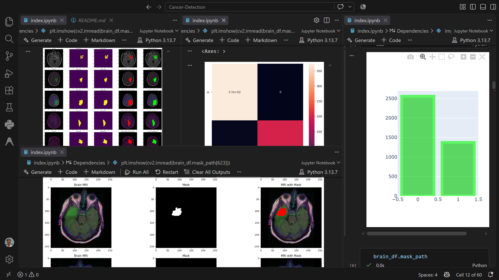

# MRI Brain Scan Cancer Detection and Segmentation Project

## Overview

This project is a medical imaging workflow designed to identify whether a brain MRI scan contains a lesion or abnormal region and, when present, localize the affected area using a segmentation model. The solution combines two deep learning stages:

1. A classification model that decides whether a scan is likely normal or abnormal.
2. A segmentation model that creates a mask to highlight the abnormal region in the image.

The implementation uses TensorFlow and Keras, begins with a pretrained ResNet50 classifier, and then builds a custom ResUNet-style segmentation network. The project also includes preprocessing, training pipelines, visualization, and evaluation logic for medical image analysis.


*Figure 1: Tumor Detection Convolutional Neural Network *

---

## Problem the project solves

Medical imaging workflows often need to support two tasks at once:

- Detecting whether a scan contains a potential abnormality.
- Identifying where the abnormal tissue is located for diagnosis support.

This project addresses that through an automated AI pipeline that helps clinicians or researchers:

- reduce manual review time,
- flag suspicious MRI scans,
- localize the affected region,
- provide interpretable overlays and masks.

In practice, this is a useful prototype for brain tumor detection, lesion segmentation, and AI-assisted radiology workflows.

---

## Project architecture

The project follows a two-stage pipeline.

### 1. Classification model
The project uses a pretrained ResNet50 network as a feature extractor.

- It loads ImageNet pretrained weights.
- The model is adapted for binary classification.
- It predicts whether an MRI belongs to a positive or negative class.
- If the model is uncertain, or the image is passed to the segmentation stage, the scan can be further analyzed.

### 2. Segmentation model
The project builds a custom ResUNet-inspired model for pixel-level segmentation.

- The network uses residual blocks and upsampling paths.
- It processes MRI images and produces a predicted mask.
- The output is a heat map / binary mask indicating the lesion region.

This is particularly important because classification alone tells whether the scan is abnormal, but segmentation tells where the abnormality is.

---

## How the project works

### Data input
The project relies on image paths stored in CSV files such as:

- data.csv
- data_mask.csv

These files contain image references and their associated mask paths, along with a label such as normal or abnormal. The MRI scans and their masks are loaded from disk, processed, and fed into Keras generators.

### Data preparation
The code performs the following:

- reads MRI paths and mask paths,
- resizes all images,
- normalizes pixel intensity,
- converts masks to binary or near-binary segmentation targets,
- splits the image dataset into training, validation, and test sets.

### Custom data generator
A custom `DataGenerator` class is implemented in `utilities.py` using `tf.keras.utils.Sequence`.

This generator:

- loads batches of MRI and mask image pairs,
- handles memory efficiency,
- keeps image augmentation and preprocessing consistent,
- supports training of segmentation models without loading all images into memory at once.

### Training flow
The project first trains a classification network from the MRI images to determine class membership. Then it trains a segmentation network on MRI images paired with segmentation masks.

The segmentation model uses a custom loss function built for medical image imbalance because lesions often cover a small portion of the image. The code includes:

- `focal_tversky`
- `tversky_loss`
- `tversky`

These are designed to focus learning on difficult or minority regions, which is critical in medical segmentation where the abnormal area might be small compared with normal tissue.

### Inference flow
At prediction time:

- the classifier identifies whether the MRI likely contains pathology,
- the segmentation model predicts the region of anomaly,
- the final result is presented as an overlay on the original scan or as a binary mask.

The project then compares the AI mask with the ground-truth mask and reports metrics such as accuracy and classification summaries.

---

## Machine learning concepts used and where they are applied

### 1. Transfer learning with ResNet50
Concept:

Transfer learning reuses a model trained on a large dataset such as ImageNet and adapts it to a new task. This saves time and often improves results when medical data is limited.

Applied in:

```python
basemodel = ResNet50(weights='imagenet', include_top=False, input_tensor=Input(shape=(256, 256, 3)))
```

This line loads the ResNet50 backbone pretrained on ImageNet. The project then adds a custom classification head on top.

Why it matters:

- medical datasets are often smaller than general computer vision datasets,
- pretrained features capture edges, textures, and shapes,
- the classifier can learn from these features faster and more reliably.

---

### 2. Convolutional neural networks (CNNs)
Concept:

CNNs are designed to learn spatial patterns in images by using convolution filters that detect edges, textures, and shapes.

Applied in:

```python
X = Conv2D(f, kernel_size=(3, 3), strides=(1, 1), padding='same', kernel_initializer='he_normal')(X)
```

This is used heavily across the ResUNet architecture. The model learns to detect features relevant to abnormal brain tissue.

Why it matters:

Brain MRI images contain spatial information that must be preserved. CNNs are ideal because they exploit the 2D structure of the image rather than treating each pixel independently.

---

### 3. Residual blocks
Concept:

Residual learning allows the network to retain useful information while learning deeper mappings. Instead of forcing a layer to learn a completely new transformation, it learns the residual difference between the input and output.

Applied in:

```python
def resblock(X, f):
    X_copy = X
    X = Conv2D(f, kernel_size=(1, 1), strides=(1, 1), kernel_initializer='he_normal')(X)
    X = BatchNormalization()(X)
    X = Activation('relu')(X)

    X = Conv2D(f, kernel_size=(3, 3), strides=(1, 1), padding='same', kernel_initializer='he_normal')(X)
    X = BatchNormalization()(X)

    X_copy = Conv2D(f, kernel_size=(1, 1), strides=(1, 1), kernel_initializer='he_normal')(X_copy)
    X_copy = BatchNormalization()(X_copy)

    X = Add()([X, X_copy])
    X = Activation('relu')(X)
    return X
```

Why it matters:

This helps the network train deeper architectures without severe degradation and is particularly useful for medical segmentation tasks.

---

### 4. U-Net style encoder-decoder architecture
Concept:

U-Net is a segmentation architecture that combines a downsampling encoder and an upsampling decoder with skip connections. The encoder extracts context, while the decoder reconstructs spatial detail.

Applied in:

```python
up_1 = upsample_concat(conv5_in, conv4_in)
up_1 = resblock(up_1, 128)
```

This code performs upsampling and concatenation with earlier layers, which is a classic U-Net pattern.

Why it matters:

It preserves the localization of small structures such as tumors or lesions while also understanding their global context.

---

### 5. Binary classification with softmax output
Concept:

A classifier assigns a probability distribution over possible classes. For binary classification, the final layer typically has two units with a softmax activation.

Applied in:

```python
headmodel = Dense(2, activation='softmax')(headmodel)
```

This predicts whether the image belongs to class 0 or class 1.

Why it matters:

The model produces probabilities that can be interpreted and thresholded for detection decisions.

---

### 6. Image segmentation with sigmoid output
Concept:

For segmentation, each pixel is treated as a prediction problem. A sigmoid activation yields a probability value per pixel, indicating whether it belongs to the lesion region or not.

Applied in:

```python
output = Conv2D(1, (1, 1), padding='same', activation='sigmoid')(up_4)
```

Why it matters:

This produces a per-pixel mask rather than a single disease label.

---

### 7. Focal Tversky loss for class imbalance
Concept:

In medical imaging, the abnormal region often occupies a small percentage of the image. Standard loss functions may focus too much on the background. Focal Tversky loss helps give more weight to correctly learning the small but important lesion region.

Applied in:

```python
model_seg.compile(optimizer=legacy_adam, loss=focal_tversky, metrics=[tversky])
```

Why it matters:

This is a common solution in segmentation problems with rare positive classes, such as small brain lesions or tumors.

---

### 8. Early stopping and model checkpointing
Concept:

Training deep models can overfit. Early stopping stops training when validation performance stops improving, while model checkpointing saves the best model weights.

Applied in:

```python
earlystopping = EarlyStopping(monitor='val_loss', mode='min', verbose=1, patience=20)
checkpointer = ModelCheckpoint(filepath='ResUNet-weights.hdf5', verbose=1, save_best_only=True)
```

Why it matters:

This reduces wasted training time and ensures the best validation model is retained.

---

### 9. Data augmentation
Concept:

Data augmentation increases diversity in the training data by applying transformations such as rescaling, flipping, rotation, and geometric changes. This helps the model generalize better.

Applied in:

```python
datagen = ImageDataGenerator(rescale=1./255., validation_split=0.15)
```

Why it matters:

MRI datasets can be limited, and augmentation helps the model become more robust to small variations in image acquisition.

---

## Libraries and their roles

| Library | Role in the project |
|---|---|
| TensorFlow / Keras | Core deep learning framework for model construction, training, and evaluation. |
| NumPy | Numerical operations, array handling, and image processing math. |
| Pandas | Reading data from CSV files and managing tabular datasets. |
| OpenCV (`cv2`) | Image loading, resizing, conversion, and visualization. |
| scikit-image | Image reading and scientific image processing. |
| scikit-learn | Train/test splitting, metrics, and classification evaluation. |
| Matplotlib | Plotting and image visualization. |
| Seaborn | Visualization of confusion matrices and statistical plots. |
| Plotly | Interactive charting. |
| Pillow (`PIL`) | Image handling compatibility and processing. |
| IPython | Notebook display support. |
| keras-preprocessing | Data generation and input pipeline utilities. |

---

## Datasets and where to download them

This project expects a dataset containing brain MRI images and corresponding lesion masks. The repository includes CSV files that reference image paths and mask paths, which indicates the project is designed to work with a structured dataset rather than raw folders only.

The typical dataset used for this type of project is a brain MRI tumor/lesion dataset, often available on Kaggle or other medical image repositories.

Recommended approach:

1. Search Kaggle for terms such as:
   - brain MRI segmentation dataset
   - brain tumor MRI dataset
   - brain MRI mask dataset
2. Download a dataset that includes paired MRI scans and segmentation masks.
3. Organize the dataset to match the expected columns used in the project, such as:
   - image_path
   - mask_path
   - mask label or classification label
4. Update the CSV files or create a new dataset definition that matches those fields.

Important note:

The project is not dependent on a single official dataset name embedded in the code. It relies on CSV paths and image directories. As long as the dataset structure matches the expected file references, it can be adapted to similar MRI datasets.

---

## How to spin up the project

### Prerequisites

- Python 3.9 or newer is recommended.
- A virtual environment is recommended.
- A GPU is optional but strongly recommended for faster model training.

### 1. Create a virtual environment

```bash
python -m venv venv
```

On Windows:

```bash
venv\Scripts\activate
```

On macOS/Linux:

```bash
source venv/bin/activate
```

### 2. Install dependencies

```bash
pip install -r requirements.txt
```

### 3. Launch the notebook

This project is primarily notebook-driven. Start Jupyter from the project directory:

```bash
jupyter notebook
```

Then open `index.ipynb`.

### 4. Run the notebook cells in order

The notebook loads the dataset, explores images, builds data generators, trains the classification model, trains the segmentation network, and performs predictions.

### 5. Optional: run the Python script version

The file `extracted_code.py` is a script version of the notebook logic. It can be used in environments where the notebook is not available, though the notebook remains the clearest and most readable version of the workflow.

---

## Important project files

- `index.ipynb` — main notebook demonstrating the full workflow.
- `extracted_code.py` — script version of the notebook logic.
- `utilities.py` — custom data generator and segmentation utilities.
- `data.csv` — dataset with MRI image references.
- `data_mask.csv` — dataset with mask references.
- `requirements.txt` — Python dependencies for the project.
- `classifier-resnet-model.json` — serialized classifier model architecture.
- `resnet-50-MRI.json` — model configuration for the loaded classifier.
- `ResUNet-model.json` — serialized segmentation model.
- `ResUNet-MRI.json` — segmentation model JSON configuration.

---

## Training and evaluation logic

### Classification evaluation
The project computes:

- confusion matrix,
- classification report,
- accuracy score.

This gives a clear view of how well the classifier distinguishes abnormal from normal MRI scans.

Relevant code includes:

```python
from sklearn.metrics import accuracy_score
accuracy = accuracy_score(original, predict)
```

and

```python
from sklearn.metrics import confusion_matrix
cm = confusion_matrix(original, predict)
```

### Segmentation evaluation
The segmentation model is trained with a domain-specific loss function and validated using medical image understanding metrics. The custom loss is important because the abnormal region is often a minority class.

The project outputs visual masks and overlays, giving an interpretable result that can be reviewed by a clinician or researcher.

---

## Strengths of this project

- Uses transfer learning to reduce training burden.
- Combines detection and localization in a single workflow.
- Uses custom image generators to handle larger datasets efficiently.
- Addresses class imbalance with custom segmentation loss.
- Provides visual screening of true and predicted masks.
- Makes the diagnosis workflow easier to interpret than a plain classification label.

---

## Limitations and considerations

This project is a strong educational and prototype implementation, but real-world medical deployment requires additional care:

- dataset quality and labeling consistency are critical,
- model performance must be validated on a separate clinical dataset,
- medical interpretation needs expert review,
- input image quality and acquisition differences can affect performance,
- the current workflow does not replace clinical judgment.

---

## Potential upgrades

### 1. Better model architecture
Possible improvements include:

- EfficientNet or DenseNet backbones,
- 3D CNNs for volumetric MRI data,
- U-Net++ or Attention U-Net variants,
- Transformer-based segmentation models.

### 2. More robust training
Add:

- more aggressive augmentation,
- stronger class balancing,
- better hyperparameter tuning,
- cross-validation across patient subsets.

### 3. Better evaluation
Use:

- Dice coefficient,
- IoU (Intersection over Union),
- sensitivity and specificity,
- precision-recall curves,
- ROC curves.

### 4. Deployment
This can be extended into:

- a web application,
- a desktop medical triage tool,
- an API service for inference,
- a PACS or hospital workflow integration.

### 5. Clinical optimization
For real operational use, additional considerations include:

- DICOM compatibility,
- patient data anonymization,
- regulatory and privacy controls,
- calibration and uncertainty estimation.

---

## Learning outcomes

This project is valuable for learning because it demonstrates several core machine learning and computer vision principles in a real domain-specific setting:

- CNNs for image analysis,
- transfer learning with pretrained networks,
- segmentation architectures for pixel-level localization,
- residual learning for deep network stability,
- custom loss functions for imbalanced medical data,
- evaluation of model outputs with visual and numerical metrics,
- how to build end-to-end ML pipelines for medical imaging.

---

## Summary

This project is a practical example of an AI-assisted brain MRI analysis workflow. It teaches how a model can first decide whether an image is abnormal and then precisely locate the suspicious region. The combination of ResNet50-based classification and a custom ResUNet-style segmentation pipeline gives a realistic view of how modern medical imaging AI systems are designed.

It is especially useful for learning the full machine learning workflow: data preparation, model building, transfer learning, segmentation, custom loss design, inference, and result interpretation.

---

## Recommended next step

If you want to deepen your understanding, work through the notebook in order and analyze each cell as follows:

1. Understand the raw data format.
2. Inspect the input image and mask relationship.
3. Trace how the data generator transforms image batches.
4. Study how the classifier is built and compiled.
5. Analyze the segmentation architecture and its skip connections.
6. Examine the custom segmentation loss.
7. Review the evaluation metrics and the visual output overlay.

This process will make the project much easier to understand conceptually and technically.

## License

[](https://www.gnu.org/licenses/gpl-3.0.html)

Mata is free and open-source software, licensed under the GNU General Public License v3.0 (GPL-3.0-or-later). This means you are free to use, study, modify, and share this software, but any derivative works must also be distributed under the same license.

> This program is free software: you can redistribute it and/or modify it under the terms of the GNU General Public License as published by the Free Software Foundation, either version 3 of the License, or (at your option) any later version.
>
> This program is distributed in the hope that it will be useful, but WITHOUT ANY WARRANTY; without even the implied warranty of MERCHANTABILITY or FITNESS FOR A PARTICULAR PURPOSE. See the GNU General Public License for more details.
>
> You should have received a copy of the GNU General Public License along with this program. If not, see <https://www.gnu.org/licenses/>.

Copyright (C) 2026 Jerome Mukindia (https://x.com/JeromeMukindia)   
---